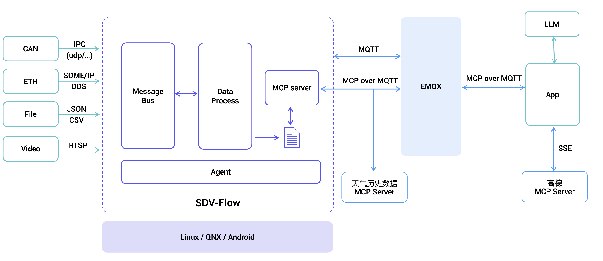

# Architecture



# Application Flow Description

## Data Collection

- Obtain vehicle driving behavior data ([Sample data](./data/vehicle_00001.json))
  - Development environment: Using simulated data
  - Production environment: Generated in real-time by sdv-flow and stored locally on the vehicle

## Data Processing

1. Location Information Parsing
   - Extract latitude and longitude coordinates from driving behavior data
   - Parse corresponding administrative division information through Gaode MCP service

2. Weather Information Correlation
   - Based on administrative division information
   - Obtain real-time weather data at the time of the event through MCP Server which encapsulates third-party API services

## Report Generation

- Integrate processed data (driving behavior, location, weather)
- Use large language models to analyze and generate UBI (Usage-Based Insurance) driving behavior reports

# Running

## Create Local .env File

```bash
# You could get the JuHe API key at https://www.juhe.cn/docs/api/id/277
JUHE_API_KEY=

# You could get the GaoDe API key at https://lbs.amap.com/api/mcp-server/create-project-and-key
GAODE_KEY=

# Silicon Flow API
SFAPI_KEY=

# Model Name
MODEL_NAME=Pro/deepseek-ai/DeepSeek-V3

# MQTT broker address
MQTT_BROKER=127.0.0.1
```

## Initialize Environment

```bash
uv sync

source .venv/bin/activate
```

## Execution

- Start emqx

```bash
docker run -d --name emqx -p 1883:1883 -p 8083:8083 -p 8084:8084 -p 8883:8883 -p 18083:18083 emqx/emqx:latest
```

- Run Weather MCP Server

```bash
uv run weather.py
```

- Run Vehicle Driving Behavior Analysis MCP Server

```bash
uv run vehicle.py
```

- Run Report Generation Script

```bash
uv run app.py
```

After executing `app.py`, a [sample report](docs/sample_report.md) will be generated.
